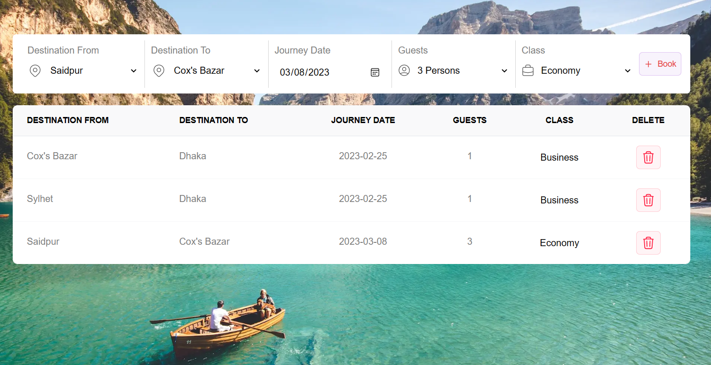

# Flight Booking State Management Using React-redux

## Live Preview (See Preview) []

### Functionality

✓ This simple project state is managed with React-redux.

✓ Destination From, Destination To, Journey Date, Guests, Class সবগুলো ফিলাপ করে Book বাটনে ক্লিক করলে ডাটা গুলো Redux store এ সেভ হবে ।

✓ The data is shown in table from redux store

✓ সর্বোচ্চ ৩ টি ডাটা এড করলে Book বাটন ডিজেবল হয়ে যাবে। অর্থাৎ সর্বোচ্চ ৩ টি রো এড করা যাবে, ৪র্থ ডেটা এড করা যাবে না ।

✓ টেবিলে থাকা ডিলিট বাটন এ ক্লিক করলে row টি ডিলিট হয়ে যাবে, সেই সাথে Redux store থেকেও ডাটা ডিলিট হয়ে যাবে।

### Screenshot of this project

